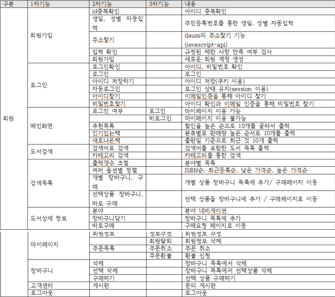

### 🔗Link

**Source**

- https://github.com/swhan9404/spring_project4 (public)
- https://github.com/swhan9404/spring_crawling(크롤링 부분)
- https://swhan9404.github.io/bookStoreVer2/project/main.html(디자인만 확인할 수 있음)

:pencil:[PPT -JSP 뼈대](https://drive.google.com/file/d/1LmT3BaNgOo3oQ0VSeWLQdSiX1ejnO3DU/view?usp=sharing)   :pencil:[PPT - spring](https://drive.google.com/file/d/1Lf4f-EqKZtxM4PrFXo273OsJSzHFuset/view?usp=sharing)

## 📖 상세 내용

수험 및 프로그래밍 서적 전문 서점이라는 컨셉으로, 실제 서점 책 데이터를 파이썬으로 크롤링해와서 데이터를 구축하고, 스프링과 오라클을 이용하여 홈페이지를 구축하였습니다.

## 🛠️ 서비스의 구성

- 서버 - Spring, Java8
- 페이지 구성 - HTML, CSS, JSP, JQuery, Javascript, Ajax, bootstrap
- 데이터베이스 - oracle
- 책 내용 크롤링 - python3, beautifulsoup, selenium

## 📱 서비스 기능

.png)

### 👨‍👦 유스케이스 다이어그램

.png)

### 📕 ERD

.png)